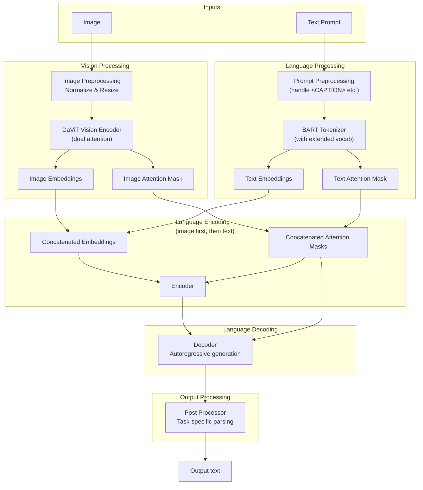

# Florence 2 Diagram

```mermaid
flowchart TB
    subgraph Inputs
        img["Image"]
        txt["Text Prompt"]
    end

    subgraph Vision Processing
        img_preproc["Image Preprocessing<br/>Normalize & Resize"]
        img_davit["DaViT Vision Encoder<br />(dual attention)"]
        img_proj["Image Embeddings"]
        img_mask["Image Attention Mask"]
    end

    subgraph Language Processing
        txt_preproc["Prompt Preprocessing<br/>(handle &lt;CAPTION&gt; etc.)"]
        txt_tok["BART Tokenizer<br/>(with extended vocab)"]
        txt_embed["Text Embeddings"]
        txt_mask["Text Attention Mask"]
    end

    subgraph "Language Encoding<br/>(image first, then text)"
        concat_feat["Concatenated Embeddings"]
        concat_mask["Concatenated Attention Masks"]
        lm_encoder["Encoder"]
    end

    subgraph Language Decoding
        lm_decoder["Decoder<br/>Autoregressive generation"]
    end

    subgraph Output Processing
        post["Post Processor<br/>Task-specific parsing"]
    end

    output["Output text"]

    img --> img_preproc
    img_preproc --> img_davit
    img_davit --> img_proj
    img_proj --> concat_feat
    img_davit --> img_mask --> concat_mask

    txt --> txt_preproc --> txt_tok
    txt_tok --> txt_embed --> concat_feat
    txt_tok --> txt_mask --> concat_mask

    concat_feat --> lm_encoder
    concat_mask --> lm_encoder
    
    lm_encoder --> lm_decoder
    concat_mask --> lm_decoder
    lm_decoder --> post --> output
```