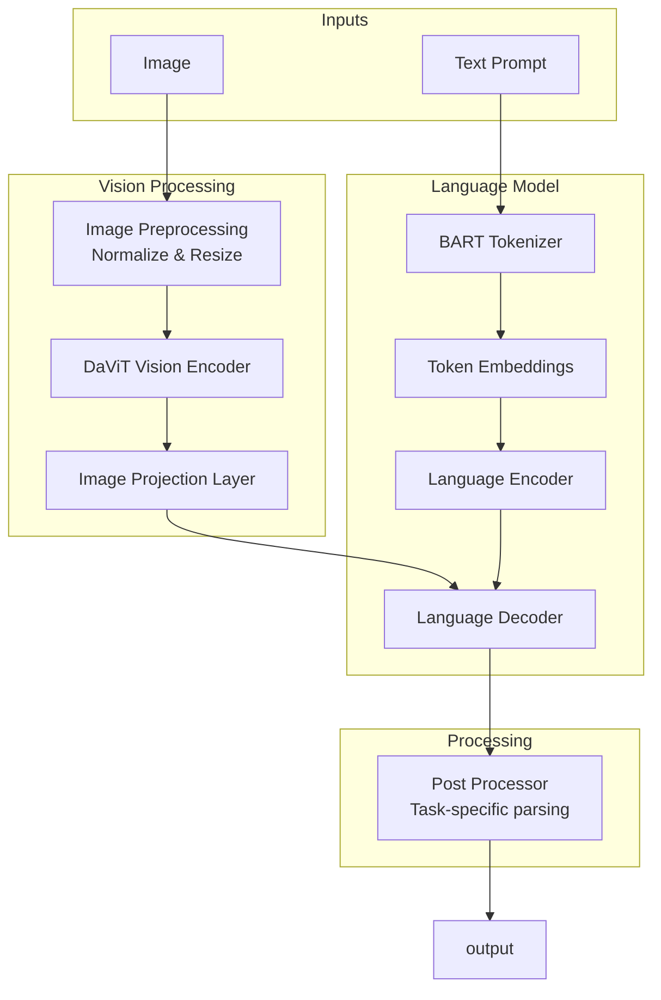

# Florence 2 Diagram

```mermaid
flowchart TB
    subgraph Inputs
        img[Image]
        txt[Text Prompt]
    end

    subgraph Vision Processing
        preproc[Image Preprocessing\nNormalize & Resize]
        davit[DaViT Vision Encoder]
        proj[Image Projection Layer]
    end

    subgraph Language Model
        tok[BART Tokenizer]
        embed[Token Embeddings]
        lmenc[Language Encoder]
        lmdec[Language Decoder]
    end

    subgraph Processing
        post[Post Processor\nTask-specific parsing]
    end

    img --> preproc
    preproc --> davit
    davit --> proj

    txt --> tok
    tok --> embed
    embed --> lmenc
    
    proj --> lmdec
    lmenc --> lmdec
    lmdec --> post --> output
```